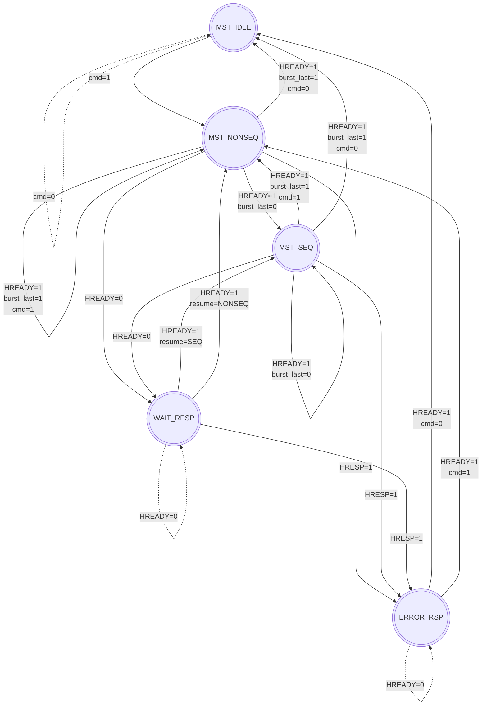

# AHB-Lite v1.0 System Design and Verification Plan

## 1. Supported and Unsupported Features

### Supported Features
- **Address Signals (`HADDR`)**: Fully supported for all memory accesses.
- **Transfers & Bursts**: Supports Single transfers and bursts of at least 1 transition increment minimum (e.g., `SINGLE`, `INCR`).
- **Transfer Sizes**: Word (32-bit), Halfword (16-bit), and Byte (8-bit) access with correct byte-lane masking.
- **Wait States**: Full support for zero-wait state operations and slave-inserted wait states via `HREADY`.

### Unsupported Features
- **Error Handling (`HRESP`)**: The FSM logic is fully implemented to handle 2-cycle `HRESP=ERROR` responses and abort bursts, but this feature is considered **unsupported**.
- **Protection (`HPROT`)**: Implemented in the master interface and tied to a default value (Data + Privileged), but dynamically driving this signal is **not supported**.
- **Locked Transfers (`HMASTLOCK`)**: Active arbiter locking is **not supported**.
- **Unaligned Transfers**: Not supported. The master expects addresses to be aligned to the transfer size.
- **Narrow Bursts**: Data bus width is fixed to 32 bits.

## 2. System Design Overview

The AHB-Lite system is designed as a modular, synthesizable AMBA 3 AHB-Lite compliant environment. It consists of a pipelined Master, an Interconnect (Decoder + Mux), and multiple Slaves.

### 1.1 Architecture
- **AHB Master (`ahb_lite_master`)**: Initiates transfers. It is highly decoupled into three sub-modules:
  - **FSM (`ahb_master_fsm`)**: Controls the `HTRANS` state and tracks the address/data phases.
  - **Address Generator (`ahb_addr_gen`)**: Calculates sequential and wrapping burst addresses dynamically based on `HSIZE` and `HBURST`.
  - **Burst Counter (`ahb_burst_counter`)**: Tracks remaining beats for fixed-length bursts.
- **Interconnect**:
  - **Decoder (`ahb_decoder`)**: Purely combinational. Decodes `HADDR[11:10]` to generate one-hot `HSEL` signals for up to 3 slaves.
  - **Multiplexer (`ahb_mux`)**: Registers `HSEL` during the address phase to correctly route the selected slave's `HRDATA`, `HREADYOUT`, and `HRESP` during the data phase.
- **Slaves**:
  - **Slave Memory (`ahb_slave_mem`)**: A 1KB memory slave that uses global `HREADY` to properly latch address-phase control signals (`HADDR`, `HSIZE`, `HWRITE`) for execution in the data phase. It performs byte-lane masking for halfword and byte accesses.
  - **Slave BFM (`ahb_slave_bfm`)**: A Bus Functional Model capable of injecting wait states (driving `HREADYOUT` low) and generating 2-cycle Error responses.

### 2.2 Master FSM Design
The Master FSM operates with 5 primary states to manage the pipelined nature of AHB:

1. `MST_IDLE`: Default state. Drives `HTRANS_IDLE`. Transitions to `NONSEQ` upon a new command.
2. `MST_NONSEQ`: First beat of a transfer. Drives `HTRANS_NONSEQ`. 
3. `MST_SEQ`: Subsequent beats of a burst. Drives `HTRANS_SEQ`.
4. `MST_WAIT_RESP`: Entered if a slave pulls `HREADY` low at the end of an address phase. Holds the current `HTRANS` and `HADDR` until `HREADY` goes high.
5. `MST_ERROR_RSP`: Handles the 2-cycle error response mechanism when `HRESP` is asserted.

### 2.3 Data Pipelining Strategy
To align write data (`HWDATA`) with the data phase (which trails the address phase by one cycle), the Master utilizes a 2-stage holding pipeline:
- `wdata_hold_r`: Latches the testbench's write data at the end of the address phase.
- `hwdata_r`: Updates to `wdata_hold_r` at the start of the data phase, holding `HWDATA` stable for the duration of the data phase, even if extended by wait states.

---

## 3. Verification Plan

The verification strategy employs a direct-test approach using a custom SystemVerilog testbench (`tb_ahb_lite_system`). The goal is to stimulate all edge cases of the AHB-Lite protocol.

### 3.1 Test Sequences

The test suite consists of 15 targeted tests designed to stress both basic features and edge cases.

| Test Category | Description | Goal |
| :--- | :--- | :--- |
| **Basic Transfers** | Single Write, Single Read, Write-Read-Verify | Validate basic data integrity and simple `NONSEQ` handling. |
| **Pipelining** | Back-to-Back Writes and Reads | Verify `HTRANS` transitioning correctly and pipelined phase overlap. |
| **Bursts (INCR)** | `INCR4`, `INCR8`, `INCR16` sequences | Ensure sequential address generation and correct beat counting. |
| **Bursts (WRAP)** | `WRAP4` burst crossing boundary | Verify precise bitwise address masking (e.g., `0x34` → `0x38` → `0x3C` → `0x30`). |
| **Wait States** | Random `HREADYOUT` delay injection | Confirm master stalls properly in `MST_WAIT_RESP` holding outputs stable. |
| **Sub-word Access** | Byte (`HSIZE_BYTE`) and Halfword accesses | Verify slave byte-lane selection logic and alignment expectations. |
| **Error Response** | 2-cycle `HRESP=1` injection | Test FSM ability to immediately abort remaining burst beats. |
| **Reset Recovery** | Assert `HRESETn` mid-transfer | Check asynchronous recovery directly to `MST_IDLE` state. |

