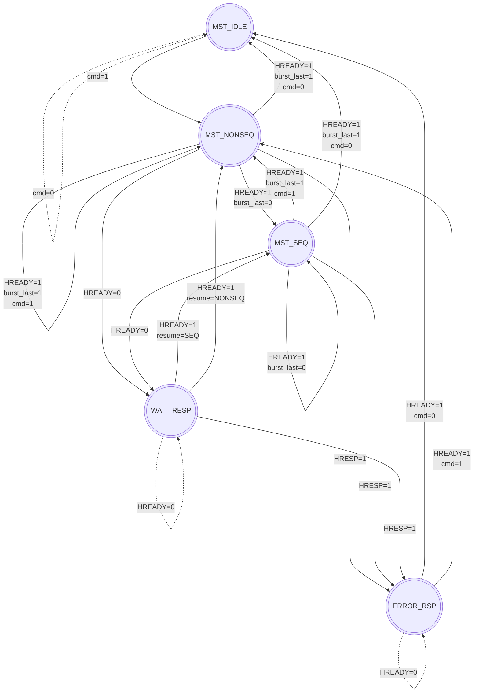

# Design Assumptions and Planning Phase

## 1. Assumptions

### AHB-Lite System Assumptions
1. **Clocking**: All AHB-Lite components operate on a single synchronous clock (`HCLK`). Reset (`HRESETn`) is active-low and asynchronous.
2. **Data Width**: The bus is 32-bits wide (`HSIZE` up to `WORD`). Transfers larger than 32-bits are not supported.
3. **Protection & Lock**: The `HPROT` and `HMASTLOCK` signals are implemented in the interface but are tied to default values (unsupported/ignored).
5. **Wait States**: Slaves can insert an arbitrary number of wait states by driving `HREADYOUT` low. The master must hold `HTRANS`, `HADDR`, `HSIZE`, `HBURST`, `HWRITE`, and `HWDATA` stable during wait states.
6. **Error Responses**: A slave error (`HRESP=1`) always spans exactly two cycles as per the AMBA 3 specification. The master will immediately abort the remainder of any active burst upon receiving an error.

### SPI Slave Assumptions
1. **Mode**: SPI operates in Mode 0 (`CPOL = 0`, `CPHA = 0`). Data is sampled on the rising edge of `SCK` and shifted out on the falling edge.
2. **Transaction Length**: Every transaction is exactly 16 bits (8-bit command/address + 8-bit data).

---

## 2. Planning Phase

This section details the architectural planning for the AMBA AHB-Lite System and SPI Slave, built strictly following the Analog Devices (ADI) Training Session guidelines.

### Architecture Overview

Unlike monolithic designs, this project utilizes a modular, hierarchical approach separating the control logic, datapath, and interconnect into dedicated system components.

| Component | File | Responsibility |
| :--- | :--- | :--- |
| **FSM Controller** | `ahb_master_fsm.sv` | Manages the 5-state Moore/Mealy hybrid machine controlling bus phases. |
| **Address Gen** | `ahb_addr_gen.sv` | Calculates `current_addr + increment` and handles complex bitwise logic for `WRAP4/8/16` boundaries. |
| **Burst Counter** | `ahb_burst_counter.sv` | Tracks remaining beats. If `SINGLE`, finishes immediately. If `INCR`, runs indefinitely. If fixed burst, stops at required count. |
| **Decoder** | `ahb_decoder.sv` | Combinatorially maps `HADDR[11:10]` to `HSEL` for up to 3 slaves. |
| **Multiplexor** | `ahb_mux.sv` | Routes `HRDATA` and `HREADYOUT` back to the master based on the latched `HSEL`. |
| **SPI Slave** | `spi_slave.sv` | 16-bit shift register mechanics synchronizing to external `SCK` edges. |
| **Reg Map** | `spi_reg_map.sv` | Maps 4 required internal registers, linked to the 7-bit SPI address field. |

### 1. `ahb_master_fsm.sv`
A dedicated synchronous controller responsible for exclusively managing the AHB-Lite phases:
- Drives `HTRANS` generation for the address phase.
- Monitors `HREADY` for the data phase of the previous beat to track the exact pipelining overlap.

### 2. `ahb_addr_gen.sv`
An independent datapath module responsible for address calculation:
- Computes subsequent addresses for `INCR` bursts based on `HSIZE`.
- Applies bitwise masking for strict `WRAP` boundaries to guarantee the address loops securely within the target window.

### 3. `ahb_interconnect.sv`
The main routing hub that orchestrates the system by linking the decoder and mux simultaneously:
- Eliminates the need for a single monolithic slave.
- Latches the address phase `HSEL` (gated by `HREADY`) so the data phase routing remains perfectly stable during pipelined overlap.

---

## 3. AHB-Lite Master State Machine Model

The following state machine was designed and modeled *before* writing the RTL code. It defines how the master transitions through the AHB phases.

### State Descriptions:
1. **`MST_IDLE`**: Default state. Bus is quiet (`HTRANS = IDLE`). Waits for a valid user command.
2. **`MST_NONSEQ`**: Initiates the first beat of any transfer. Drives `HTRANS = NONSEQ` and the start address.
3. **`MST_SEQ`**: Used for the 2nd to Nth beats of a burst. Drives `HTRANS = SEQ` and the sequential (or wrapped) addresses.
4. **`MST_WAIT_RESP`**: Entered if a slave asserts wait states (`HREADY = 0`). The master holds all control signals stable and waits for the slave to finish the data phase.
5. **`MST_ERROR_RSP`**: Entered if the slave asserts `HRESP = 1`. This is the second cycle of the 2-cycle error response. After this cycle, the master cancels the burst and returns to `IDLE`.
