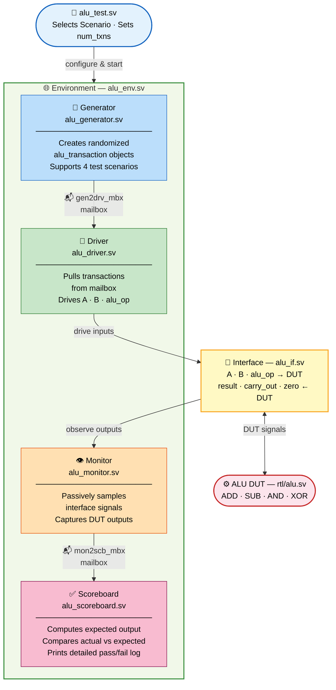
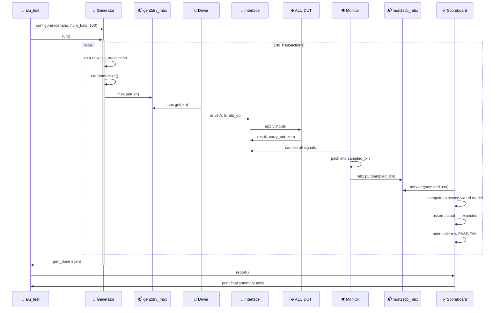

# 4-Operation ALU — Layered SystemVerilog Testbench

**Author:** Youssef Medhat Mahmoud  
**Program:** ADI Summer 2026 Internship Training  
**Date:** July 2026

---

## Table of Contents
1. [Overview](#overview)
2. [ALU Design Specification](#alu-design-specification)
3. [Testbench Architecture](#testbench-architecture)
4. [Layered Testbench Diagram](#layered-testbench-diagram)
5. [Component Descriptions](#component-descriptions)
6. [Test Scenarios](#test-scenarios)
7. [Project Structure](#project-structure)
8. [Verification Results](#verification-results)

---

## Overview

This project implements a **parameterized 8-bit 4-Operation Combinational ALU** and verifies it using a **Layered SystemVerilog OOP Testbench**. The testbench follows standard industry verification methodology using Object-Oriented Programming (OOP) principles with SystemVerilog classes, mailboxes, and events — without any third-party libraries.

---

## ALU Design Specification

| `alu_op[1:0]` | Operation | Type       | `carry_out` Meaning       |
|---------------|-----------|------------|---------------------------|
| `2'b00`       | **ADD**   | Arithmetic | Carry flag (overflow)     |
| `2'b01`       | **SUB**   | Arithmetic | Borrow flag (underflow)   |
| `2'b10`       | **AND**   | Logical    | Always `0`                |
| `2'b11`       | **XOR**   | Logical    | Always `0`                |

**Flags:**
- `carry_out` — Set on arithmetic overflow (ADD) or borrow (SUB)
- `zero` — Set when `result == 8'h00` for any operation

---

## Testbench Architecture

The testbench follows a **4-Layer architecture** that cleanly separates concerns:

| Layer | Component | Responsibility |
|-------|-----------|----------------|
| **Layer 1** (Stimulus) | `Generator` | Creates randomized `alu_transaction` objects |
| **Layer 2** (Execution) | `Driver` | Applies transactions to the DUT through the Interface |
| **Layer 2** (Observation) | `Monitor` | Passively samples the Interface and captures DUT outputs |
| **Layer 3** (Checking) | `Scoreboard` | Compares actual DUT outputs against expected values |
| **Layer 4** (Orchestration) | `Environment` | Instantiates and connects all components |
| **Layer 4** (Configuration) | `Test` | Selects the scenario and controls the run |

---

## Layered Testbench Diagram



---

## Data Flow Diagram



---

## Component Descriptions

### `alu_transaction.sv` — Transaction Object
The atomic unit of stimulus. Holds one complete set of ALU inputs and the observed outputs.
```
Fields: A, B (8-bit), alu_op (2-bit), result (8-bit), carry_out, zero
Methods: randomize(), print()
```

### `alu_generator.sv` — Stimulus Generator
Creates `alu_transaction` objects and pushes them into the `gen2drv_mbx` mailbox.
- **Scenario 0:** Fully random A, B, and alu_op
- **Scenario 1:** Random A, B — alternates ADD / SUB only
- **Scenario 2:** Random A, B — alternates AND / XOR only
- **Scenario 4:** Directed corner cases (overflow, underflow, zero result)

### `alu_driver.sv` — Interface Driver
Pulls transactions from `gen2drv_mbx` and drives `A`, `B`, `alu_op` onto the virtual interface.

### `alu_monitor.sv` — Output Observer
Passively samples the interface signals (`A`, `B`, `alu_op`, `result`, `carry_out`, `zero`) and packages them into a new `alu_transaction` object, pushed into `mon2scb_mbx`.

### `alu_scoreboard.sv` — Checker & Reference Model
Pulls observed transactions from `mon2scb_mbx`, computes the **expected** outputs using a built-in reference model, then asserts:
```
actual_result    == expected_result
actual_carry_out == expected_carry_out
actual_zero      == expected_zero
```
Prints a final summary report with total transactions checked and errors found.

### `alu_env.sv` — Environment
Instantiates all components, creates shared mailboxes, and forks all `run()` tasks in parallel using `fork...join_any`.

### `alu_test.sv` — Test
Instantiates the environment, selects the test scenario, sets the number of transactions, and calls `env.run()`.

### `alu_if.sv` — Interface
Bundles all DUT signals into a single `virtual interface` that is shared between the Driver and Monitor.

---

## Test Scenarios

| Scenario | `+SCENARIO=` | Description |
|----------|-------------|-------------|
| Full Random | `0` | 100 fully random inputs across all 4 operations |
| Arithmetic Only | `1` | Alternates ADD and SUB with random operands |
| Logical Only | `2` | Alternates AND and XOR with random operands |
| Corner Cases | `4` | Directed: ADD overflow, SUB underflow, zero result, XOR self |

---

## Project Structure

```
alu_layered_testbench/
│
├── rtl/
│   └── alu.sv                  # RTL: Parameterized ALU design
│
└── tb/
    ├── alu_if.sv               # Interface: Bundles all DUT signals
    ├── alu_transaction.sv      # Transaction: Stimulus data object
    ├── alu_generator.sv        # Generator: Creates randomized transactions
    ├── alu_driver.sv           # Driver: Applies stimulus to DUT via interface
    ├── alu_monitor.sv          # Monitor: Observes DUT outputs passively
    ├── alu_scoreboard.sv       # Scoreboard: Self-checking reference model
    ├── alu_env.sv              # Environment: Connects all components
    ├── alu_test.sv             # Test: Top-level test configuration
    └── tb_top.sv               # Top Module: DUT + Testbench instantiation
```

---


## Verification Results

```
╔══════════════════════════════════════════════════════╗
║           SCOREBOARD FINAL REPORT                   ║
╠══════════════════════════════════════════════════════╣
║  Total Transactions Checked : 104                   ║
║  Total PASS                 : 104                   ║
║  Total FAIL                 : 0                     ║
╠══════════════════════════════════════════════════════╣
║  Per-Operation Breakdown:                            ║
║  ┌──────────┬──────────┬──────────┐                 ║
║  │ Operation│  PASS    │  FAIL    │                 ║
║  ├──────────┼──────────┼──────────┤                 ║
║  │   ADD    │  28      │  0       │                 ║
║  │   SUB    │  28      │  0       │                 ║
║  │   AND    │  19      │  0       │                 ║
║  │   XOR    │  29      │  0       │                 ║
║  └──────────┴──────────┴──────────┘                 ║
╠══════════════════════════════════════════════════════╣
║  RESULT:  ✅  ALL TESTS PASSED                       ║
╚══════════════════════════════════════════════════════╝
```

✅ **All 100+ randomized transactions passed with 0 errors!**
