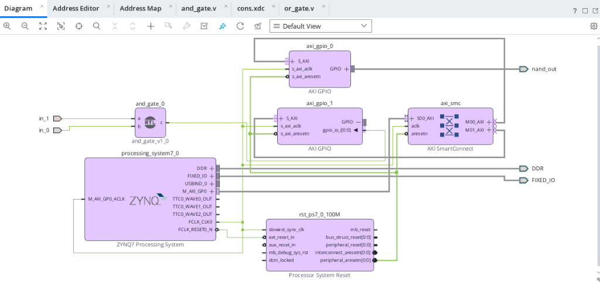
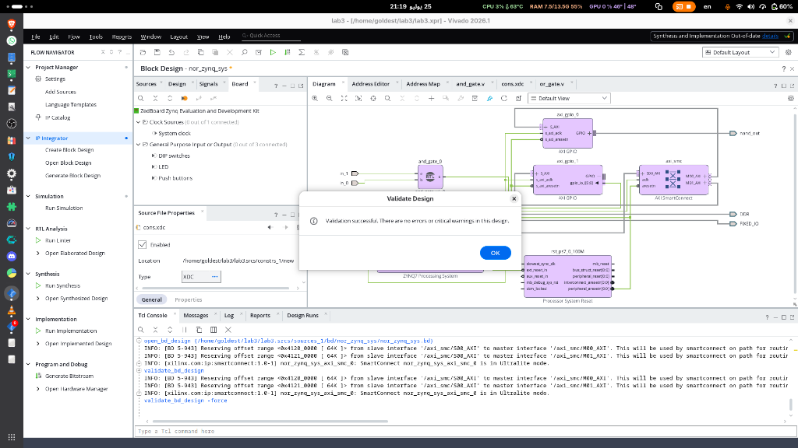
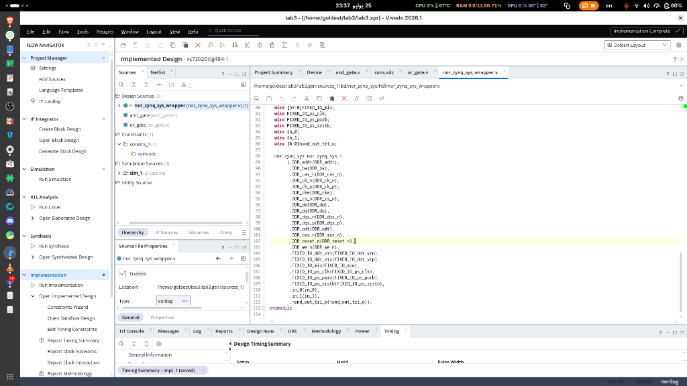
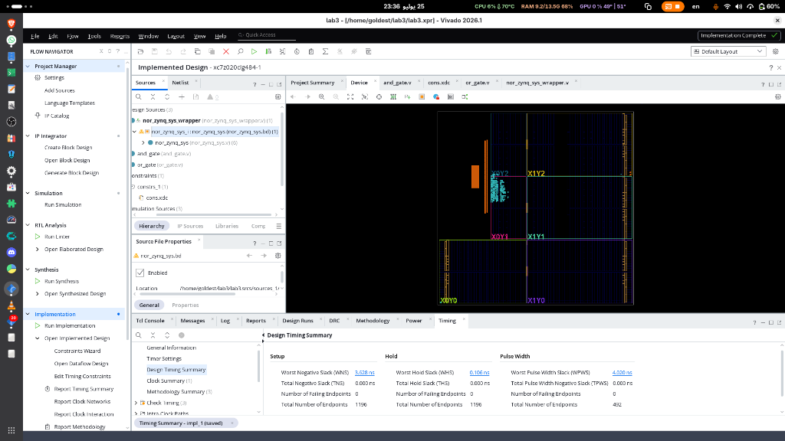
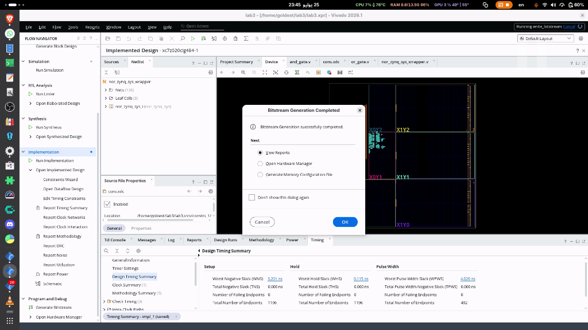

# Assignment 2: Zynq Hardware/Software Co-Design (NAND Gate)

## Objective
The goal of this assignment is to implement a NAND gate using a combination of the Programmable Logic (PL) and the Processing System (PS) on a Zynq FPGA (ZedBoard).
- **Programmable Logic (PL):** Implements an AND gate that takes two inputs (`in_0`, `in_1`).
- **Processing System (PS):** Runs C code on the ARM Cortex-A9 processor to read the AND gate output, invert it (NOT gate), and write the final NAND result to an LED output.

---

## Step 1: Block Design and Hardware Integration
An IP Integrator Block Design (`nor_zynq_sys`) was created to connect the hardware components. 
- An RTL module (`and_gate.v`) was added to compute the logical AND of the two external inputs.
- A **Zynq Processing System** was instantiated along with two **AXI GPIO** blocks.
- `axi_gpio_0` reads the output of the AND gate.
- `axi_gpio_1` writes the inverted result back out to the `nand_out` port.



---

## Step 2: Design Validation
The block design was validated to ensure all AXI interconnects, clocks, and resets were correctly mapped with no critical warnings or errors.



---

## Step 3: HDL Wrapper Generation
After validating the design, an HDL wrapper (`nor_zynq_sys_wrapper.v`) was generated to instantiate the block design into the top-level Verilog hierarchy so it could be synthesized.



---

## Step 4: Constraints and Implementation
A constraints file (`cons.xdc`) was created to map:
- `in_0` to switch SW0 (`F22`)
- `in_1` to switch SW1 (`G22`)
- The output `nand_out_tri_o[0]` to LED LD0 (`T22`)
- All ports were set to `IOSTANDARD LVCMOS33`.

The design was then successfully synthesized and implemented, meeting all timing constraints.



---

## Step 5: Bitstream Generation
With implementation complete and constraints correctly applied, the hardware bitstream was successfully generated. This bitstream programs the PL portion of the Zynq chip.



---

## Step 6: Software Application (Vitis IDE)
The hardware was exported as an `.xsa` file (including the bitstream) and loaded into the Vitis Unified IDE. A standalone C application was written to run on the `ps7_cortexa9_0` processor. 

The software reads the value from `AXI_GPIO_0` (the AND gate output), performs a bitwise NOT operation (`~`), and writes the result to `AXI_GPIO_1` (the LED output), completing the NAND logic.

### `main.c` Snippet:
```c
#include "platform.h"
#include "xgpio.h"
#include "xparameters.h"

int main() {
    init_platform();
    XGpio input, output;
    int a, y;

    // Initialize GPIOs
    XGpio_Initialize(&input, XPAR_AXI_GPIO_0_DEVICE_ID);
    XGpio_Initialize(&output, XPAR_AXI_GPIO_1_DEVICE_ID);

    // Set directions (1 = input, 0 = output)
    XGpio_SetDataDirection(&input, 1, 1);
    XGpio_SetDataDirection(&output, 1, 0);

    while(1) {
        a = XGpio_DiscreteRead(&input, 1);  // Read from AND gate
        y = ~a;                             // Invert to create NAND
        XGpio_DiscreteWrite(&output, 1, y); // Write to LED
    }

    cleanup_platform();
    return 0;
}
```
