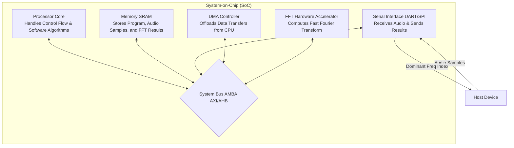

# Audio Processing SoC Design Assignment

## 1. SoC Architecture Block Diagram



### Component Descriptions:
- **Processor Core (CPU):** Manages the overall system operation, configures peripherals, triggers the FFT accelerator, and executes the peak detection algorithm (software).
- **Memory (SRAM):** Acts as the central storage for incoming audio samples, intermediate FFT results, and the main program instructions.
- **Serial Interface (UART/SPI):** The communication bridge with the host device to receive raw audio samples and transmit the final dominant frequency location.
- **DMA Controller:** Handles bulk data movement (e.g., from UART to Memory, and Memory to FFT Accelerator) without interrupting the CPU, maximizing system efficiency.
- **FFT Hardware Accelerator:** A dedicated digital logic block designed to compute the Fast Fourier Transform highly efficiently, offloading this computationally heavy task from the CPU.

---

## 2. Hardware-Software Partitioning

### Hardware Modules
1. **Serial Communication (UART/SPI):** Implemented in hardware because serial protocols require precise timing and continuous bit-level sampling that would waste CPU cycles if done via bit-banging.
2. **DMA Controller:** Implemented in hardware to enable parallel operation. The CPU can sleep or do other work while the DMA autonomously moves incoming audio samples into memory.
3. **FFT Accelerator:** The Fast Fourier Transform is computationally expensive ($O(N \log N)$). Implementing it as a custom hardware accelerator significantly reduces processing time, lowers power consumption, and ensures real-time constraints are met for continuous audio streams.

### Software Modules
1. **System Control & Orchestration:** The CPU runs software to initialize the DMA, configure the UART, and start the FFT accelerator. Managing the control flow is inherently sequential and well-suited for a general-purpose processor.
2. **Peak Detection (Finding Dominant Frequency):** Identifying the highest frequency component requires iterating over the FFT results and finding the maximum value. This is a simple linear search ($O(N)$). Since it's not computationally intensive, implementing it in software is highly efficient and saves silicon area that would be wasted on a dedicated peak-detector hardware block.

---

## 3. Algorithm Pseudocode (Software Part)

```text
function main():
    // 1. Initialization Phase
    Initialize_UART(baud_rate=115200)
    Initialize_DMA()
    Initialize_FFT_Accelerator(fft_size=1024)
    
    allocate audio_buffer[1024]
    allocate fft_output[1024]
    
    // Main Processing Loop
    while True:
        // 2. Receive Audio Samples
        // CPU configures DMA to move data from UART RX to memory and goes to sleep/waits
        Start_DMA_Transfer(source=UART_RX, destination=audio_buffer, size=1024)
        Wait_For_Interrupt(DMA_COMPLETE)
        
        // 3. Hardware Acceleration (FFT)
        // CPU configures the accelerator registers with buffer addresses and triggers execution
        Write_Register(FFT_INPUT_ADDR, address_of(audio_buffer))
        Write_Register(FFT_OUTPUT_ADDR, address_of(fft_output))
        Write_Register(FFT_CONTROL, START_EXECUTION)
        
        Wait_For_Interrupt(FFT_COMPLETE)
        
        // 4. Software Processing: Peak Detection
        dominant_freq_index = 0
        max_magnitude = 0
        
        // Iterate through the first half of the FFT output (Nyquist limit)
        for i from 0 to 512:
            // Calculate magnitude: sqrt(real^2 + imag^2)
            // (Note: in practice, we can just compare squared magnitudes to save computing sqrt)
            magnitude_squared = (fft_output[i].real * fft_output[i].real) + 
                                (fft_output[i].imag * fft_output[i].imag)
                                
            if magnitude_squared > max_magnitude:
                max_magnitude = magnitude_squared
                dominant_freq_index = i
                
        // 5. Transmit Results
        // Send the location of the dominant frequency back to the host
        Send_UART_Data(dominant_freq_index)
```
